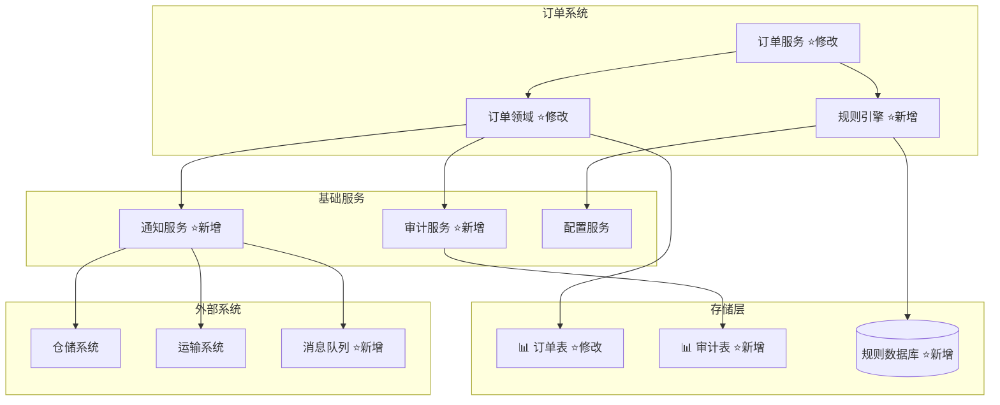
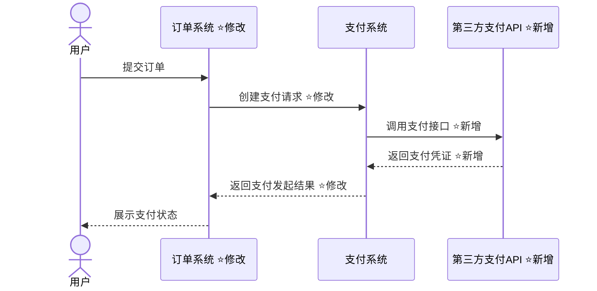
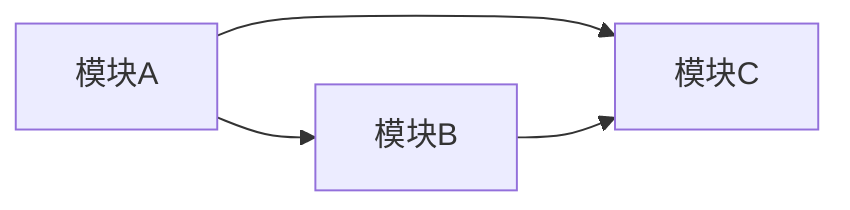
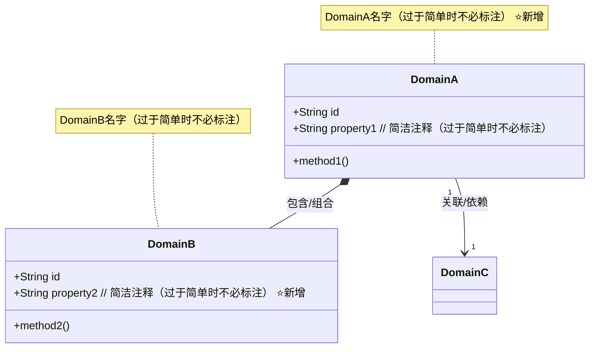
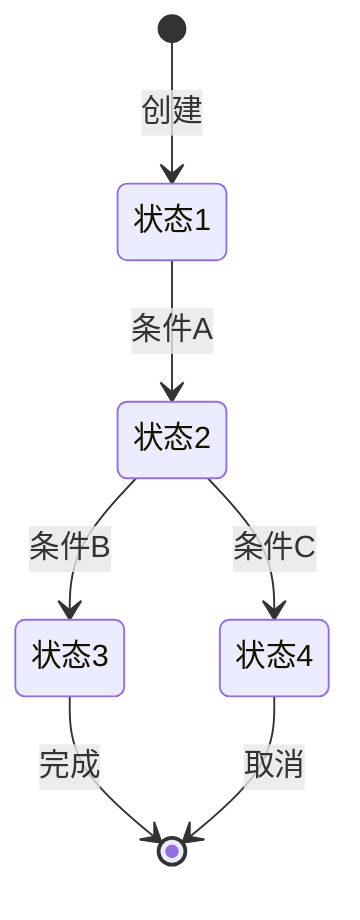
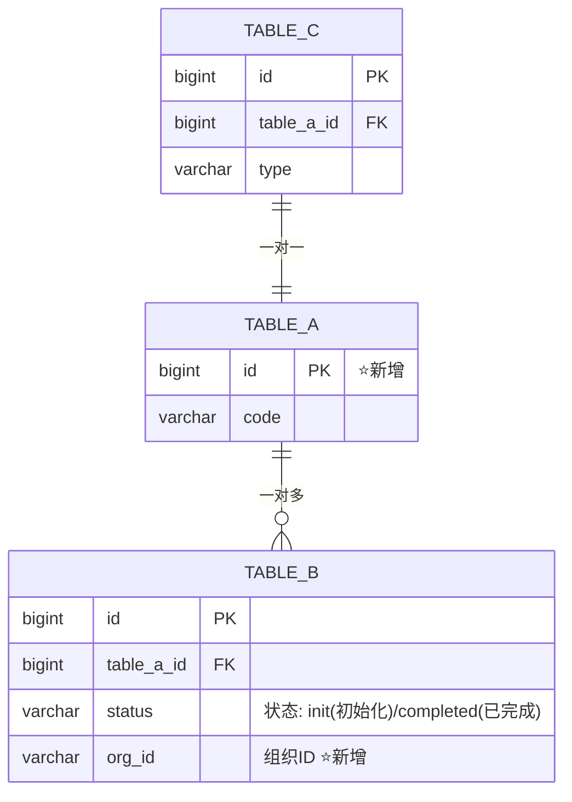

# [需求名称]技术方案

## 文档修订历史

| 版本 | 时间 | 修订人 | 说明 |
|------|------|--------|------|
| V0.0.1 | [YYYY-MM-DD] | [修订人] | [修订内容说明] |

### 用户说明
> {{USER_ADDITIONAL_NOTES}}

---

## 1. 背景和目标

### 术语
| 术语 | 说明 |
|------|------|
| [术语 1] | [定义] |
| [术语 2] | [定义] |

### 需求背景

[简要描述本次需求的业务背景和要解决的核心问题，2-3段文字]

结构化需求：[结构化需求.md](./结构化需求.md)

### 目标
- 目标1：[具体的业务/技术目标]
- 目标2：[具体的业务/技术目标]
- 目标3：[具体的业务/技术目标]

---

## 2. 总体设计

### 系统架构

[显示本次需求所选的架构模式和系统边界。展示影响本的模块和位置，要包含与外部关键系统的集成交互关系。用 ⭐ 标注新增或修改的模块]
[系统架构中"外部系统"的内容，请放到大图的下面或者侧边，且同一个外部系统的内容要合并]



### 业务流程设计

#### [名称 1] 业务流程

<!--
填写说明：

(1)参与者定义：
- 业务系统或角色（如：订单系统、物流系统）：直接命名
- 定时任务或系统自动触发的流程：发起方为系统

(2)标注规范：
- 使用 ⭐新增 表示本次新增的系统或步骤
- 使用 ⭐修改 表示本次修改的系统或步骤

(3)流程图范围：
- 一个图只展示一个完整的业务流程，禁止混入其他独立的业务流程，多个流程需拆分为独立的 sequenceDiagram
- 此处只描述业务流程，技术实现细节（Controller、Service、Mapper等）在"详细设计"章节说明
-->



#### [名称 2] 业务流程
[同上]


---

## 3. 详细设计

### 3.1 模块概览
[模块分为两类：核心业务模块、支撑服务模块。需求不一定涉及支撑服务模块。]
[核心业务模块，比如：用户管理模块、数据处理模块等。支撑服务模块，比如：缓存服务模块]
[模块名称必须是全中文，功能需求驱动。正例：优惠券发放模块，反例：新增XxxService]

#### 模块职责和依赖关系

| 编号 | 模块名称 | 核心职责 | 主要功能 |
|-----|---------|---------|---------|
| 1 | [模块A] | [职责描述] | [功能列表] |
| 2 | [模块B] | [职责描述] | [功能列表] |



### 3.2 [模块A]详细设计

[描述该模块的核心职责和边界]

#### 模块业务流程

<!--
填写说明：

(1)何时需要：
- 模块内涉及核心的业务流程
- 需要说明外部服务调用时机

(2)何时可省略：
- 逻辑简单，如：简单 CRUD 操作

(3)流程图类型选择指南：
- **Sequence Diagrams（优先使用）**：用于展示该模块的用户交互流程，体现各关键对象间的调用关系和关键的业务逻辑
- **Process Flow Charts**：用于展示复杂算法、决策分支或业务处理流程
- **Data Flow Diagrams**：用于展示数据转换、ETL 过程或数据管道的流向
- **Event Flow**：用于展示异步/事件驱动架构中的事件传递流程

(4)注意事项：
- 状态机在后续"状态机设计"章节说明，此处禁用
- 可以画多个流程图，分别展示不同的业务场景
- 复杂逻辑建议配合文字描述说明
-->

**外部服务依赖信息**

[列出该模块依赖的必要且关键的外部服务，如无外部依赖可省略此部分。]

| 外部服务名称 | 服务类型 | 调用场景 | 服务信息 |
|------------|---------|---------|---------|
| [服务A] | [HSF/MQ/HTTP等] | [何时调用] | [HSF服务名/MQ TOPIC/HTTP URL] |
| [服务B] | [HSF/MQ/HTTP等] | [何时调用] | [HSF服务名/MQ TOPIC/HTTP URL] |


#### 领域模型

**核心领域对象**

[领域对象不是DO、VO，而是业务核心实体]
[领域对象可能会涉及到本次需求改动的模型与未改动的模型之间的关系！]

**核心领域对象职责**

| 领域对象 | 关键职责 | 文件路径 |
|----------|------|------|
| [DomainA] | [对象职责] | [完整路径] |
| [DomainB] | [对象职责] | [完整路径] |




##### [DomainA] 状态机设计（如领域对象存在状态流转）
[如果核心领域对象存在状态流转（如订单状态、任务状态等），才需要状态流转图。]
[明确定义状态机模型，包括所有状态、允许的状态转换和转换条件。]
[避免直接的自环转移（如 STATE_A --> STATE_A），允许间接循环（如 STATE_A --> STATE_B, STATE_B --> STATE_A）]

**状态说明**
- [状态1]：[中文描述]
- [状态2]：[中文描述]
- ...

**状态流转**



##### [DomainB] 状态机设计（如领域对象存在状态流转）
[同上]

#### 核心服务接口

**服务接口定义**

```java
/**
 * [注释]
 */
interface [ClassName1] {
  /**
   * [注释]
   */
  [ReturnType] [methodName1]([ParamType] [paramName]);

  [其他接口方法，格式同上]
}

<!--
- 重点描述**技术决策**，帮助技术评审人员快速识别设计合理性
- 优先描述：关键算法逻辑、重要的技术选型
- 可使用伪代码、表格或文字描述，选择能说明问题的最简洁方式
- 如果仅涉及简单链路，如CRUD，则必须省略此章节
- 如果仅涉及项目通用规范的遵守，则必须省略此章节
-->
class ParamType {
    [Type] property1; // [仅保留有价值的注释（业务规则、枚举值、格式说明、条件要求等）]
    [Type] property2;
}

class ReturnType {
    [Type] property1; // [仅保留有价值的注释（业务规则、枚举值、格式说明、条件要求等）]
    [Type] property2;
}
```

#### 关键实现点（如适用）

<!--
- 重点描述**技术决策**和**核心实现逻辑**，帮助技术评审人员快速识别设计合理性
- 优先描述：架构扩展点、设计模式应用、关键算法逻辑、重要的技术选型
- 可使用伪代码、表格或文字描述，选择能说明问题的最简洁方式
- 如果仅涉及简单链路，如CRUD，则必须省略此章节
- 如果仅涉及项目通用规范的遵守，则必须省略此章节
-->

### 3.3 [模块B]详细设计

[同上]

---

## 4. 接口设计

<!--
接口设计原则：
1. 代码简洁性：移除package和import语句，降低信息密度干扰
2. 注释精简化：
   - 字段注释使用内联格式（// 注释内容），避免冗余的多行JavaDoc
   - 仅保留有价值的注释（业务规则、枚举值、格式说明、条件要求等）
   - 避免为过于简单的字段添加注释
3. 变更标识规范：
   - ⭐新增 标记仅用于类/接口级别（如接口、DTO、Request类的注释）
   - 字段级别不使用标记，避免干扰视线
   - 实现类路径也需标注 ⭐新增
4. 参考规范：遵循项目的SDK规范（如有）
-->

### Web API（如适用）
[如果当前应用系统模式中包含Web层并且需求涉及外部Web接口变更，则编写此章节]
详细的接口定义（包含完整的接口代码、参数类型定义等）请参考：[Web接口设计.md](./Web接口设计.md)

### HSF服务（如适用）
[如果当前应用系统模式中包含RPC层并且需求涉及外部HSF接口变更，则编写此章节]

**服务接口列表**

| 服务接口 | 方法名 | 功能说明 | 服务分组 |
|----------|--------|----------|----------|
| [ServiceFacade] | methodName | [功能描述] | [分组名] |
| [ServiceFacade] | methodName2 | [功能描述] | [分组名] |

#### [服务名A]

**服务接口**: `[完整包名.ServiceFacade]`

**服务版本**: [版本号]

**服务分组**: [服务分组]

**功能说明**: [服务整体功能描述]

**实现类路径**: `[相对路径/ServiceImpl.java]` ⭐新增

**接口定义**:

```java
/**
 * [服务名称] ⭐新增
 */
public interface ServiceFacade {

    /**
     * [方法功能说明]
     *
     * 业务规则:
     * 1. [关键业务规则说明]
     * 2. [错误码说明]
     */
    ResultModel<ReturnDTO> methodName(RequestDTO request);

    /**
     * [方法功能说明]
     * @return [返回值说明]
     */
    ResultModel<DataResult<ListItemDTO>> queryList(QueryParamDTO param);
}
```

**请求对象**:

```java
/**
 * [请求对象名称] ⭐新增
 */
@Data
@EqualsAndHashCode(callSuper = true)
public class RequestDTO extends AbstractIdempotentRequestDTO {
    private String field1;  // [格式说明/业务含义]
    private String field2;
    private List<String> field3;  // [枚举值说明: A/B/C]
}
```

**返回数据对象**:

```java
/**
 * [返回对象名称] ⭐新增
 */
@Data
public class ReturnDTO {
    private Long id;
    private String name;
    private String status;  // [状态说明: INIT(初始化)/COMPLETED(已完成)]
    private BigDecimal amount;  // [金额说明]
    private Date operationTime;  // [来自操作表]
}
```

#### [服务名B]
[同上]

---

## 5. 数据存储设计

### 5.1 数据模型设计

#### ER关系图

[使用 mermaid ER 图描述与本次需求相关的数据模型（含改动的模型及关联的未改动的关键模型）及其相互关系。]
[ER 图对于有改动的模型进行明确的标识，具体要求为在新增表的主键字段的备注列中添加 "⭐表新增" 标识，在修改表的变更字段的备注列中添加 "⭐新增/⭐修改-原为xxx"。]
[ER 图只展示核心字段（特别是外键、状态等关键字段），因为下面的"表结构设计"章节会介绍每个字段]



### 5.2 表结构设计
[如果需求没有涉及表结构变更，则不需要写`表结构设计`章节]

#### [表A]表设计

表名：[DB中物理表名称]
说明：[表的业务含义]

**字段定义**

| 字段名 | 变更类型 | 数据类型 | 默认值 | 是否为空 | 说明 |
| --- | --- | --- | --- | --- | --- |
| id | 保持 | bigint(20) unsigned | - | NOT NULL | 主键ID |
| gmt_create | 保持 | datetime | - | NOT NULL | 创建时间 |
| gmt_modified | 保持 | datetime | - | NOT NULL | 更新时间 |
| creator | 保持 | varchar(64) | - | NOT NULL | 创建人 |
| modifier | 保持 | varchar(64) | - | NOT NULL | 更新人 |
| column1 | 保持 | varchar(128) | - | NULL | [字段说明] |
| column2 | **新增** | int(11) | - | NULL | [字段说明] |

**索引设计**

[索引名称只能以`pk_`或`uk_`或`idx_`开头]
[如果需求没有涉及索引变更，则不需要写`索引设计`章节]

| 索引名称 | 变更类型 | 索引类型 | 索引字段 | 说明 |
| --- | --- | --- | --- | --- |
| PRIMARY | 保持 | 主键 | id | 主键索引 |
| uk_column1 | 保持 | 唯一索引 | column1 | [索引用途说明] |
| idx_status_time | **新增** | 组合索引 | status, gmt_create | [索引用途说明] |

#### [表B]表设计

[同上]

---

## 6. 非功能性设计（如适用）

[必要的话，才需要编写此章节。主要描述：性能、数据一致性对账等方面]

---

## 7. 测试与上线

### 7.1 关键测试场景

**功能测试场景**

| 测试场景 | 测试内容 | 预期结果 | 优先级 |
|----------|----------|----------|--------|
| [场景1] | [测试步骤] | [预期结果] | P0 |
| [场景2] | [测试步骤] | [预期结果] | P1 |
| [场景3] | [测试步骤] | [预期结果] | P2 |

**异常场景测试**

| 异常场景 | 触发条件 | 预期处理 | 优先级 |
|----------|----------|----------|--------|
| [异常1] | [触发方式] | [处理方式] | P0 |
| [异常2] | [触发方式] | [处理方式] | P1 |

### 7.2 监控埋点

**业务监控指标**

| 监控指标 | 埋点位置 | 告警阈值 | 说明 |
|----------|----------|----------|------|
| [业务量] | [埋点说明] | [阈值] | [监控目的] |
| [成功率] | [埋点说明] | [阈值] | [监控目的] |
| [异常量] | [埋点说明] | [阈值] | [监控目的] |

---

## 附录一 - 参考文档

[此章节仅引用文档，不要附上其他内容]
- [相关技术文档] (技术文档链接)
- [相关需求文档] (技术文档链接)

## 附录二 - 数据库变更 SQL 详情

[列出本次需求涉及的所有数据库变更 SQL，包括建表、修改表结构、索引变更等。如无数据库变更可省略此章节]
[变更SQL、回滚SQL：应遵循向后兼容原则，禁止包含删除表、修改表名、删除字段、修改字段名等破坏性操作，避免在灰度发布期间导致旧版本服务不可用]

**变更说明**：[简要说明本次数据库变更的整体目的和影响范围]

**变更 SQL**（如适用）

```sql
-- ============================================
-- 表 A 变更
-- ============================================
-- 新增字段
ALTER TABLE `table_a`
ADD COLUMN `column2` int(11) NULL COMMENT '[字段说明]';

-- 新增索引
ALTER TABLE `table_a`
ADD INDEX `idx_status_time` (`status`, `gmt_create`);

-- ============================================
-- 表 B 建表
-- ============================================
CREATE TABLE IF NOT EXISTS `table_b` (
    `id` bigint(20) unsigned NOT NULL AUTO_INCREMENT COMMENT '主键',
    `gmt_create` datetime NOT NULL COMMENT '创建时间',
    `gmt_modified` datetime NOT NULL COMMENT '修改时间',
    `creator` varchar(64) NOT NULL COMMENT '创建人',
    `modifier` varchar(64) NOT NULL COMMENT '更新人',
    `table_a_id` bigint(20) unsigned NOT NULL COMMENT '表A的ID',
    `property` varchar(128) NULL COMMENT '[字段说明]',
    PRIMARY KEY (`id`),
    INDEX `idx_table_a_id` (`table_a_id`)
) ENGINE=InnoDB DEFAULT CHARSET=utf8mb4 COMMENT='[表的业务含义]';
```

**回滚 SQL**（如适用）

```sql
-- ============================================
-- 数据回滚
-- ============================================
-- 示例：批量恢复数据
UPDATE `table_a`
SET `property` = '原值'
WHERE `tenant_id` = 'xxxx';
```
